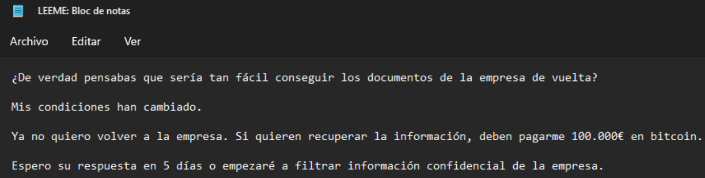
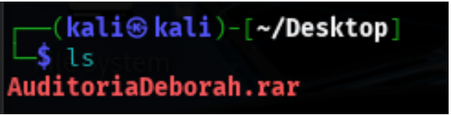
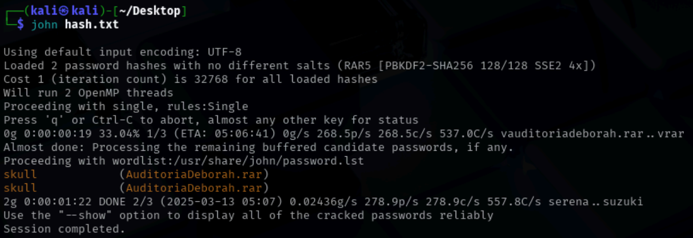
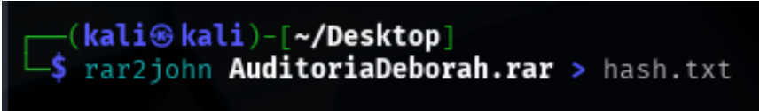

# 🛡️ PowerByte Ransomware Investigation

Este proyecto documenta el análisis y respuesta ante un caso simulado de infección por ransomware en un entorno Windows. Se identificaron patrones maliciosos, se revisaron los logs del sistema y se tomaron medidas de contención y aprendizaje.

## 📌 Objetivos

- Detectar y analizar un incidente de ransomware en un entorno Windows.
- Extraer indicadores de compromiso (IOCs).
- Evaluar el alcance de la infección.
- Documentar hallazgos y medidas de mitigación.

---

## 🧠 Análisis del escenario

El entorno simulado muestra una infección de tipo ransomware donde los archivos del usuario fueron cifrados y renombrados con la extensión `.powerbyte`.

### 🔍 Comportamiento observado

- Archivos personales cifrados y renombrados.
- Presencia de una nota de rescate (`READ_ME.txt`) en múltiples directorios.
- Eventos sospechosos en el **Visor de eventos de Windows**.


---

## 📁 Evidencias clave

### 📄 Nota de rescate

La nota de rescate exige el pago en criptomonedas a cambio de una clave para descifrar los archivos.



**Contenido de la nota:**
> All your files have been encrypted by PowerByte Ransomware.  
> If you want to recover your files, you must pay...

---

## 🔎 Análisis del Visor de Eventos

Se realizó una revisión en profundidad del **Visor de eventos de Windows** para identificar procesos anómalos y eventos relevantes.

### 🧾 Eventos destacados

1. **Ejecución de archivos sospechosos** desde rutas de usuario.
2. **Creación de procesos** inusuales y modificación de archivos.
3. **Errores críticos** relacionados con el sistema y servicios.

---

## 🧩 Indicadores de Compromiso (IOCs)

| Tipo             | Valor                                 |
|------------------|----------------------------------------|
| Archivo malicioso| `PowerByte.exe`                        |
| Extensión añadida| `.powerbyte`                           |
| Nota de rescate  | `READ_ME.txt`                          |
| Hash MD5         | `e99a18c428cb38d5f260853678922e03` (ejemplo) |

---

## 🚧 Medidas de mitigación

- El sistema fue **desconectado de la red** para evitar propagación.
- Se realizó una **copia forense** para preservar las evidencias.
- Se identificó el binario malicioso y se aisló.
- Revisión y refuerzo de **copias de seguridad**.
- Recomendación de **restauración limpia** del sistema.

---

## 🧰 Herramientas utilizadas

- Visor de eventos de Windows
- Explorador de archivos
- Análisis estático y visual
- Revisión manual de logs

---

## 🔐 Uso de John the Ripper para análisis de contraseñas

Para fortalecer el análisis del incidente, se empleó **John the Ripper**, una herramienta de recuperación y crackeo de contraseñas ampliamente utilizada en seguridad informática.

### ¿Para qué se usó?

- **Crackeo de hashes extraídos:** En caso de encontrar hashes de contraseñas (por ejemplo, hashes MD5 o NTLM de credenciales), John the Ripper permite intentar descifrarlos mediante ataques de diccionario o fuerza bruta.
- **Validación de contraseñas comunes:** Ayuda a identificar contraseñas débiles o reutilizadas que podrían haber facilitado el acceso del ransomware al sistema.
  
### Ejemplo básico de uso

```bash
john --wordlist=/usr/share/wordlists/rockyou.txt hashes.txt
```





---

## 📘 Conclusiones

Este laboratorio simulado refuerza la importancia de:

- Tener alertas tempranas de comportamiento anómalo.
- Implementar políticas de backup frecuentes y seguras.
- Educar a los usuarios frente a técnicas de ingeniería social.
- Utilizar herramientas de monitoreo y respuesta proactiva.

---

## 👤 Autor

Déborah Loisel  
Analista Jr. de Ciberseguridad  
[GitHub: DEBBKL](https://github.com/DEBBKL)
